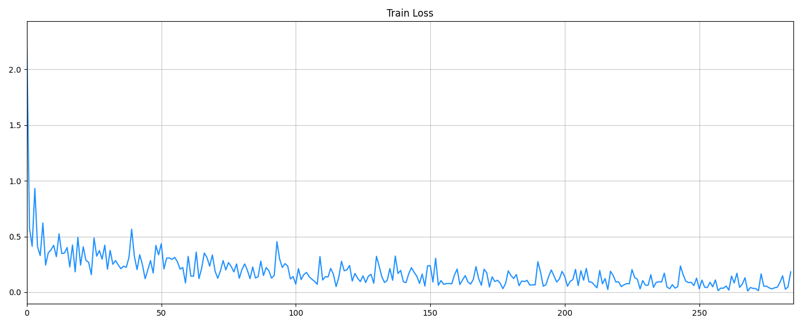
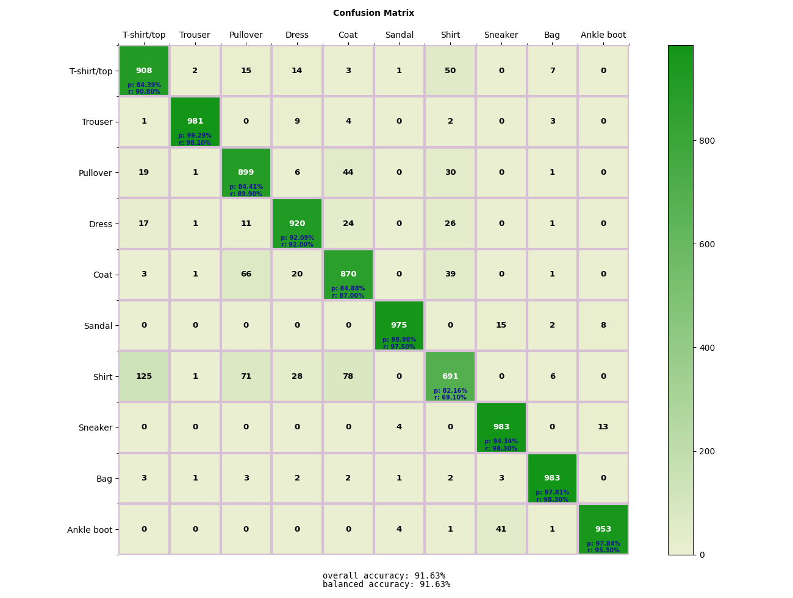

#### This is my implementation of simple CNN model for training on Fashion MNIST dataset.  
<br/><br/>

### **Requirements:**
- pytorch
- torchvision
- tensorboard: &nbsp;&nbsp;&nbsp;`pip install tensorboard`
- matplotlib: &nbsp;&nbsp;&nbsp;&nbsp;&nbsp;&nbsp;&nbsp;`pip install matplotlib`

To install pytorch and torchvision: go to [pytorch.org](https://pytorch.org/get-started/locally/)  
<br/><br/>

### **Usage:**
To train model:  
```
python train_model.py
```

At the end of training model will save into `logs/expr_<xxx>` folder. Also you can use tensorboard to see more of training process by:
```
tensorboard --logdir=logs
```  
<br/>

To test model:

```
python test_model.py <path to saved model>
```  
<br/><br/>

### **Results:**
#### Test Accuracy: 91.63%
***
#### Train Loss:

***
#### Test confusion matrix:

<br />
